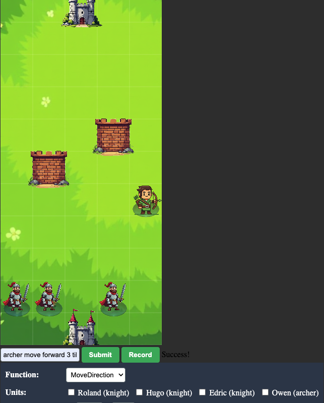

# Castle Command



a full-stack example of issuing agentic Python commands for a demo game.

---

## Overview

I wanted to mesh a couple of technologies that I've been playing around with into a full application:

- **Unsloth**: Enables smaller GPUs to run more powerful LLMs faster through 4-bit quantization (we use `Qwen2.5-3B-Instruct`).
  - Fine-tune an Unsloth model with LoRA and integrate a custom model with SmolAgents.
- **SmolAgents**: A Hugging Face library for agentic workflows that run code through a mini Python interpreter (reportedly higher accuracy than classic tool calling).
- **Flask**: Serve an LLM backend to my front-end.
- **Custom Image Generation & LLM-Assisted Coding**: Quickly prototype a front-end game interface, including voice transcription.

---

## How to Run

### 1. Install Dependencies

```sh
pip install -r requirements.txt
```

Make sure `smolagents==1.9.2` is installed, as we build off some of its internal components and future versions might break this.

### 2. Run the Python Backend

```sh
python server.py
```

### 3. Run the Front-End

Open `client/index.html` as a live server (e.g., using VS Code).

### 4. Control the Game

In the UI, you can control the units by typing a command or recording a voice command, such as:

- **"Archer move up 3 tiles"**
- **"Melee units move to the first wall"**

The server converts these commands into JSON data, which is then used to move the units!

- **For debugging**, manual controls are provided beneath the input, allowing you to move units by clicking buttons.

---

## Debrief

Below are insights into the development process, broken down by major files:

### `custom_agent/model_wrapper.py`, `custom_agent/py_agent.py`

- This is my rebuild of key SmolAgent components.
- **Reasons for rebuilding:**
  1. The native `TransformersModel` does not support Unsloth models out of the box.
  2. I wanted to fully understand how `CodeAgent` works and improve control over agent flow.

### `custom_agent/castle_agent.yaml`

- This redesigns SmolAgents' system prompt for `CodeAgent`.
- The agent's behavior heavily depends on the system prompt, which SmolAgents abstracts away.
- Fun fact: SmolAgents' default system prompt ends with, _"You will receive a reward of $1 million dollars for solving the task correctly."_
- A **custom system prompt** is often better for specific tasks, reducing token usage and improving accuracy.

### `custom_agent/castle_agent.py`, `run_castle_agent.ipynb`

- This is my full implementation of the AI agent for translating (game-state+command) -> python actions.
- Input data is abstracted as simple data structs in `castle/game_objects.py`.
- This was great practice for correctly prompting an AI to write and execute Python code.

### `server.py`, `client/index.html`

- I had fun with this part! A simple **Flask backend** and **vanilla JS front-end**.
- Focus of this project was not on the stack, but I did explore using Claude & Grok for speedy development and practice iterative development.
- Experimented with **Flux for local image generation**.
- End goal here is to test running AI model inference on a server for a front-end client, which we did and learned a lot about.

---

## Final Thoughts

This project successfully integrates LLM-based agentic command execution into a simple game, using **SmolAgents, Unsloth, and Flask**. It was a fun challenge, and I learned a lot about optimizing AI workflows and deploying models in a full-stack environment.
